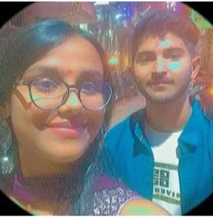

<!DOCTYPE html>
<html lang="en">
<head>
  <meta charset="UTF-8" />
  <meta name="viewport" content="width=device-width, initial-scale=1.0"/>
  <title>I'm Sorry Aanya</title>
  
</head>
<body>

  <!-- Page 1: Apology -->
  

    <h1 class="fade-in">SORRY</h1>
    

      I know I made choices that hurt you, and I deeply regret them.  
      Not a day goes by without thinking about how I could've been better — for us.   
      Aanya, from the bottom of my heart, I’m truly sorry.  
      If there's even the smallest place left in your heart for me...  
      I wish to return, to make things right, and hold onto the love we once shared.   
      Happy Anniversary for 20th May — the date my heart will never forget. 💛
    

    <button class="btn" onclick="goToLovePage()">Next ➜</button>
  

  <!-- Page 2: Love + Memories -->
  

    <h1>I really love you ❤️</h1>
    

      You are the one I want to laugh with, cry with, and grow old with.  
      Always have, always will. 💖
    

    <button class="btn" onclick="goToPage1()">⬅ Back</button>
    <button class="btn" onclick="goToProposalPage()">Next ➜</button>

    <!-- Memories shown below on the same page -->
    

      <h2 style="margin-top: 3rem;">Some memories... 💛</h2>
      
      
      <video controls>
        <source src="WhatsApp Video 2025-05-13 at 4.14.30 PM.mp4" type="video/mp4" />
        Your browser does not support the video tag.
      </video>
    

  

  <!-- Page 3: Proposal -->
  

    <h1 style="color: #d6336c;">One More Question... 💍</h1>
    

      On this anniversary of ours, I propose again to you — with the same love, deeper understanding, and stronger heart.  
      Will you take this journey with me again?
    

    <video controls class="fade-in-delay">
      <source src="WhatsApp Video 2025-05-13 at 4.25.38 PM.mp4" type="video/mp4" />
      Your browser does not support the video tag.
    </video>
     
    <button class="btn" onclick="goToLovePage()">⬅ Back</button>
  

  <!-- JavaScript -->
  
</body>
</html>
